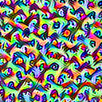

# Lucid for Keras (lucid4keras)

Want to generate beautiful images by [Feature Visualization](https://distill.pub/2017/feature-visualization/) that [lucid](https://github.com/tensorflow/lucid) does with Keras models?

The codes provided by lucid imports tensorflow graph. This wrapper adds a additional function to make keras model feed to lucid. Kept the structure of lucid as it is as possible so majority of the its function (e.g. transform_f, param_f, objective_f) can be used.

Conclusion: Works (almost) like lucid way.

lucid

```python
#load model
model = models.InceptionV1()
model.load_graphdef()
#render
_ = render_vis(model, "target_layer_name:index_of_neuron")

```

lucid4keras

```python
#prepare model
model = keras.applications.inception_v3.InceptionV3()
model = prepare_model(model,layer_name=target_layer_name)
#render
_ = keras_render_vis(model,index_of_neuron)

```

## Notice

this library is only a wrapper to run lucid with keras models. borrows a lot of func from lucid (https://github.com/tensorflow/lucid) and many codes as it is or partially rewritten for adaptation. If you with to use this library somewhere else, you first must cite and/or acknowledge Olah et al., 2017 Distil (https://distill.pub/2017/feature-visualization/) and its github repository and lucid4keras (https://github.com/totti0223/lucid4keras) as well.  License is stated at the end of this page. Follws the original license of lucid and keras.


## Examples

Images from Mixed4:Neuron 300 (left),  Mixed5:Neuron 408 (right), Mixed0:Neuron 230 in InceptionV3 of keras stored imagenet trained weights and structure. Generated images resembles that of pure lucid.




## How to use

### Dependencies

lucid version 0.3 (and newer?)

keras version 2.0 and newer

if you have the top two package installed already you are sufficient to run.

### Installation

git clone this repository and do

```
pip install .
```

### Examples

See the jupyter notebook for concrete examples. 

#### [Example_part_1](examples/ex1.ipynb)

basic usage

​	simple single seuron visualization,

​	objective_f usage

​	param_f usage

​	neuron mixing. (merging two or more losses)

​	image transformation

​	negative maximization

​	batch processing

​	changing sizes of input shape

​	random directions

####  [Example_part_2](examples/ex2.ipynb)

more functions

​	interpolating betwen neurons

#### [Example_part_3](examples/ex3.ipynb)

testing with different kind of CNNs

​	InceptionV3

​	VGG19

​	Xception

​	InceptionResNetV2

## Technical Notes: Modification points made to feed keras models to lucid

**1-1. model modification upon import**

​	Lucid handles tensorflow graph models which relu layers are always(?) separated from the conv2d layer. By defining the layer (ex. prerelu layer) and index of neuron, output loss can be specified without modifying the graph structure. However in keras, sometimes the conv2d layer is merged with the relu layer, so have to explicitly change the relu layer or conv2d with relu to keras.activations.linear.  Save and reimporting must be done to apply changes. so anyway, also created a intermediate output model with the defined layer name so can prepare the model at the same time

```python
model = prepare_model(model,layer_name=target_layer_name)
```

**1-2. modified Objective Class**

​	As target layer is no longer needed for defining losses, modified the Objective class without it. replacing with .output which is a output tensor of keras model.​	

```python
lambda T: tf.reduce_mean(T(layer)[batch, ..., n_channel])
```

to

```python
lambda T: K.mean(T.output[batch,..., n_channel])
```

2. **Combining the model to the transformation layer to create a temp new model.**

   ​	The lucid transformation_f can be handled as a layer in keras with a lambda layer. so creating a model that connects the transformation layer model (top model) and the base model (bottom model) can be described as the following.

   ```python
   input_tensor = Input(shape=input_size)
   transformed = Lambda(lambda inputs: transform_f(inputs),name="transform_layer")(input_tensor)
   top = Model(inputs=input_tensor,outputs=transformed)
   
   target_model = Model(inputs = top.input,
                 outputs = bottom(top.output))
   ```

   ​	Then we define the gradient function by the objective_f, gradient of input image w.r.t. loss, and a function by keras.

   ```python
   loss = objective_f(target_model)
   grads = K.gradients(loss,target_model.input)[0]
   train = K.function([target_model.input, K.learning_phase()], [loss, grads])    
   ```

   The important thing is that  "target_model" is the transformation layer combined with the model of interest. so <u>if we backpropate, it will calculate until pre transformation</u>*1, which seems quite unique to lucid. since other visualiztion techniques stop the backprop post transformation.

  


**3-1. Iterating and calculating the gradient without tensorflow session**

Creating a tensorflow session and make a train_op maybe one way, but i could not understand the session management in tensorflow with keras in the present situation, so did it the easy way.

From the [official blog](https://blog.keras.io/how-convolutional-neural-networks-see-the-world.html) written by the author of keras, gradient ascent can be described with the defined K.funtion as the following

```python
for i in range(20):
    loss_value, grads_value = iterate([input_img_data]) 
    input_img_data += grads_value * step
```

iterate is the defined K.function() 

so decided to follow that format.

**3-2. numpy based adam calculation**

since session is not used, the default tensorflow adam optimizer or keras adam optimizer seems to be not available, so rewrote the adam calculation in numpy.

```python
def adam(grads, cache_m,cache_v,iters,
         lr, beta1, beta2):
    if cache_m is None:
        cache_m = np.zeros_like(grads)
    if cache_v is None:
        cache_v = np.zeros_like(grads)
    iters += 1

    cache_m = (beta1 * cache_m) + (1. - beta1) * grads
    cache_v = (beta2 * cache_v) + (1 - beta2) * (grads * grads)
    mc = cache_m / (1. - (beta1 ** iters))
    vc = cache_v / (1. - (beta2 ** iters))

    lr_t = lr * np.sqrt(1. - (beta2 ** iters)) / (1. - (beta1 ** iters)) #learning rate
    step = (lr_t * mc)/ (np.sqrt(vc) + 1e-8)

    return step, cache_m, cache_v, iters
```

now if we feed the obtained grads per iteration with the iteration step integer, it will caculate the step value  from grads. repetatively adding the step to input image as well as applying transformation will produce a very "lucidic" image even using keras models.

**3-3. t_image out from tensor**

Because adam is calculated on cpu, preparing input_image on GPU on lucid makes the calculation slower. therefore pulled from the gpu to cpu by calling the following code once.

    _t_image = make_t_image(param_f)
    _t_image = K.eval(_t_image)
in the future if adam is rewritten to run on gpu, maybe the above K.eval may not be needed anymore, but in the current situation runs in satisfying speed so will not do anymore for now.

4. **Added "batch_n" to objective class.**


### Issues that need time.

1. **lucid.misc.gradient_override import gradient_override_map cannot be used**

I did not go through the details of this function yet, but this seems to be passing through the gradients linearly only between values 0 to 6 and 0 for negative and fixed value for over 6, so that not only the negative value during backpropagation is blocked therefor will be an unbalanced result (am i correct?). Instead of such gradientoverride, implemented a simple linear modification against the layer of interest. Looking through whether this is applicapable to keras models.

2. **Neuron mathmatics between different layers. cannnot be used**

As it is obvious, the model that is feeding is a intermediate output model and defining the loss based on the last layer, so cannot add two neurons for synthetic loss comprising from two different layers.

### Will be migrated in the future

- DeepDream
- regularizers (l1, l2, total variance etc)
- activating "neurons" within a image (objectives.neuron)
- diversity

### What I want to do

customized optimizer_f compatible with lucid4keras.

suppose  changing modes, 

​	1.naive gradient

​	2.rmsprop normalized

​	3.adam normalzied

​	4. .... normalized

The problem is that the type of variable feeding and returning variables differs between optimizers

ex.  grad = naive(grad)

grad, cache = rmsprop(grad,cache,iter)

grad, cache_m,chace_v = adam(grads, cache_m,cache_v,iters,lr, beta1, beta2)

have to study more python to unify that in one function or class.


## License

Apache 2.0. see [license](LICENSE)


## Author

Yosuke Toda 

tyosuke[at]aquaseerser.com

JST PRESTO Researcher at ITbM Nagoya Univ. Japan


## Acknowledgement

1. Y.T. is currently hired and supported by a Japan Science and Technology Agency (JST) PRESTO grant (Y.T., JPMJPR1705)

2. *1[@colah](https://github.com/colah) at the [lucid issue thread](https://github.com/tensorflow/lucid/issues/119) for answering the logics behind lucid.